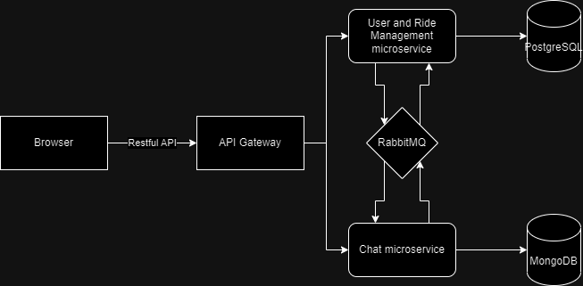

# PAD_LABS #
The first laboratory on PAD course in UTM

My project is a ride-sharing app with features like ride booking, chat functionality, and more . It can benefit from a microservices architecture to ensure scalability, maintainability, and flexibility.

## Real-world example : ##

A real-world example of a ride-sharing app that uses microservices architecture is Uber. Uber is a globally recognized ride-sharing platform that relies on microservices to provide its services at scale. Here's how Uber leverages microservices:
Microservices in Uber:
1.	**User and Account Management**: Uber has microservices responsible for user registration, authentication, and account management. These services handle user profiles, payment methods, and preferences.
2.	**Ride Booking**: The core of the Uber app revolves around ride booking. This microservice handles ride requests, matches riders with available drivers, calculates fares, and manages the status of ongoing rides.
3.	**Geolocation**: Uber relies heavily on geolocation services to track user and driver locations in real-time. Microservices handle location tracking, route calculation, and map rendering.
4.	**Driver Management**: This microservice manages driver accounts, driver ratings, and driver availability. It ensures that drivers are appropriately matched with riders.
5.	**Payments and Billing**: Uber's payment system is a critical component. Microservices handle payment processing, including payment gateway integrations, billing, and invoicing.
6.	**Communication**: Real-time communication between riders and drivers, such as chat and notifications, is managed by a dedicated microservice. It ensures that messages are delivered in real-time.
7.	**Surge Pricing**: Uber's dynamic pricing model uses microservices to adjust prices based on demand and supply in real-time.
8.	**Analytics and Metrics**: Microservices are responsible for collecting and analyzing data related to rides, user behavior, and performance. This data helps Uber optimize its services.

## My ride-sharing app microservices - ##

Here are two essential microservices for such an app:
1.	**User and Ride Management Microservice:**
   * This microservice handles user registration, authentication, and profile management. It also manages the core functionality of the ride-sharing platform, including:
   * Ride booking and scheduling
   * Matching riders with drivers
   * Tracking ride progress
   * Rating and reviewing rides
   * Communication with drivers and riders for ride updates.
   * Data related to users, rides, and ride history can be stored and managed within this microservice.
2.	**Chat and Messaging Microservice:**
   * This microservice is responsible for real-time chat and messaging between riders and drivers. It enables features like:
   * In-app chat for ride coordination and communication
   * Push notifications for ride updates
   * Media sharing (e.g., location sharing, photos)
   * Provides a scalable and responsive messaging platform for all users.
   * Ensures that messages are delivered in real-time and maintains message history.

Reasoning:
   * Separating these functionalities into microservices allows for independent development and scaling of each component.
   * It ensures that if one component, such as the chat system, experiences high traffic, it can be scaled independently without affecting other parts of the application.
   * It helps isolate potential issues and failures, ensuring that a problem in one microservice does not bring down the entire application.
 
##Technology Stack and Communication Patterns ##

Certainly, for a ride-sharing app with user and ride management in Python and chat/messaging and payment/billing in JavaScript, I will choose the following technology stack and communication patterns:

**User and Ride Management Microservice (Python):**

  * Programming Language: Python
  * Framework: Flask or Django (for building RESTful APIs)
  * Database: PostgreSQL or MySQL for data storage
  * Communication Pattern: RESTful APIs (synchronous communication) for interactions with the client-side and other microservices.

**Chat and Messaging Microservice (JavaScript):**
  * Programming Language: JavaScript (Node.js for server-side)
  * Framework: Express.js for building RESTful APIs
  * Database: MongoDB or another NoSQL database for real-time messaging data
  * Communication Pattern: WebSocket or other real-time communication protocols for chat functionality (asynchronous communication). RESTful APIs for interactions with other microservices (synchronous communication).

Reasoning:
  * Python is a strong choice for backend development and is well-supported for building RESTful APIs.
  * Flask and Django are popular Python frameworks for building web services.
  * JavaScript (Node.js) is well-suited for real-time communication and asynchronous tasks like chat functionality.
  * Express.js is a lightweight and flexible framework for building RESTful APIs in JavaScript.
  * PostgreSQL or MySQL provide robust data storage options for relational data, while MongoDB is suitable for real-time messaging data.
  * WebSocket is ideal for real-time chat and messaging, ensuring instant message delivery.
  * RESTful APIs can be used for synchronous communication, providing a standardized way to interact with each microservice.

For asynchronous communication between microservices, I will consider using message queues like RabbitMQ or Apache Kafka . However, for the described components at this moment, RESTful APIs and WebSocket for chat should suffice for most use cases.

## Data Management Approach: ##
1. User and Ride Management Microservice (Python):
•	This microservice will manage user profiles, ride information, and user-ride associations.
•	It will have its own database for storing user and ride data.
2. Chat and Messaging Microservice (JavaScript):
•	This microservice will handle real-time messaging data between users.
•	It will use a separate database to store chat messages and maintain message history.

**Data Flow and Endpoints:**

Now, let's consider how data will flow through my app, focusing on key user interactions:

1. **User Registration and Authentication (User and Ride Management):**
   * Endpoint for User Registration:
     * **URL:** /api/users/register
     * **Request Body (JSON Format):**
     ```json
     { "username": "john_doe",
      "email": "john@example.com", 
     "password": "password123" } 
     ```
  
     * **Response Body (JSON Format):**
     ```json
     { "userId": "1234567890", 
     "username": "john_doe", 
     "email": "john@example.com", 
     "createdAt": "2023-09-20T08:00:00Z" } 
     ```
   * Endpoint for User Login:
     * **URL:** /api/users/login
     * **Request Body (JSON Format):**
     ```json
       { "email": "john@example.com", 
       "password": "password123" } 
     ```
       * **Response Body (JSON Format with JWT):**
     ```json
       { "token": "your_jwt_token_here",
        "userId": "1234567890", 
       "username": "john_doe" } 
       ```


2.	**Ride Booking (User and Ride Management):**
   * **Endpoint for Booking a Ride:**
     * **URL:** /api/rides/book
     * **Request Body (JSON Format):**
     ```json
     { "userId": "1234567890",
      "driverId": "driver123",
      "origin": "123 Main St",
      "destination": "456 Elm St" } 
     ```
  
     *	**Response Body (JSON Format):**
       ```json
     { "rideId": "ride123", 
     "userId": "1234567890", 
     "driverId": "driver123",
      "origin": "123 Main St", 
     "destination": "456 Elm St",
      "status": "pending" } 
       ```
3.	**Real-time Chat (Chat and Messaging):**
   * **WebSocket Endpoint for Real-time Chat:**
     * Real-time communication between users and drivers for ride coordination.
     * Messages are sent and received in real-time using WebSocket connections.
     * No RESTful endpoints are used for chat messages, as they are handled asynchronously through WebSocket.

4.	**View Available Rides (User and Ride Management):**
   * **Endpoint for Viewing Available Rides:**
     * **URL:** /api/rides/available
     * **Request Method:** GET
     * **Request Parameters (Query Parameters):**
  
     Optional filters such as location, date, time, etc.

     * **Response Body (JSON Format, Array of Available Rides):**
     ```json
     [ 
     { "rideId": "ride123",
     "driverId": "driver456", 
     "origin": "123 Main St", 
     "destination": "456 Elm St", 
     "departureTime": "2023-09-21T10:00:00Z", 
     "seatsAvailable": 2, 
     "fare": 15.00 },
     { "rideId": "ride789",
     "driverId": "driver789", 
     "origin": "789 Oak St", 
     "destination": "321 Pine St", 
     "departureTime": "2023-09-21T11:30:00Z",
     "seatsAvailable": 3, 
     "fare": 12.50 } 
     ] 
     ```
     * **Endpoint Description:**
     
     Users can send a GET request to /api/rides/available to retrieve a list of available rides based on optional filters (e.g., location, date, time).The response includes details about each available ride, such as the ride ID, driver ID, origin, destination, departure time, available seats, and fare. Users can choose one of the available rides based on their preferences.

5.	**Create Ride Offer (User and Ride Management):**
* **Endpoint for Creating a New Ride Offer:**
  * **URL:** /api/rides/create
  * **Request Method:** POST
  * **Request Body (JSON Format):**
  ```json
  { "driverId": "driver123",
  "origin": "123 Main St", 
  "destination": "456 Elm St", 
  "departureTime": "2023-09-23T09:30:00Z",
  "seatsAvailable": 3, 
  "fare": 20.00 } 
  ```
  * **Response Body (JSON Format):**
  ```json
  { "rideId": "ride456", 
  "driverId": "driver123", 
  "origin": "123 Main St", 
  "destination": "456 Elm St", 
  "departureTime": "2023-09-23T09:30:00Z", 
  "seatsAvailable": 3, 
  "fare": 20.00 } 
  ```
  * **Endpoint Description:**

  Users can send a POST request to /api/rides/create to create a new ride offer.
  The request body should include details of the ride offer, such as the driver ID, origin, destination, departure time, available seats, and fare.Upon successful creation, the response provides information about the newly created ride offer, including the ride ID, driver ID, origin, destination, departure time, available seats, and fare.

6.	**List All Available Rides for a specific route (User and Ride Management):**
   * **Endpoint for Listing All Available Rides for a specific route:**
     * **URL:** /api/rides/available-for-route
     * **Request Method:** GET
     * Optional filters such as date, time, and number of available seats.
     * **Response Body (JSON Format, Array of Available Rides for the Route):**
     ```json
      [
       {
         "rideId": "ride123",
         "driverId": "driver456",
         "origin": "123 Main St",
         "destination": "456 Elm St",
         "departureTime": "2023-09-21T10:00:00Z",
         "seatsAvailable": 2,
         "fare": 15.00
       },
       {
         "rideId": "ride789",
         "driverId": "driver789",
         "origin": "123 Main St",
         "destination": "456 Elm St",
         "departureTime": "2023-09-21T11:30:00Z",
         "seatsAvailable": 3,
         "fare": 12.50
       }
      ]
     ```
   * **Endpoint Description:**

Users can send a GET request to /api/rides/all to retrieve a list of all available rides.
The response includes details about each available ride, such as the ride ID, driver ID, origin, 
destination, departure time, available seats, and fare.Users can view and choose from the entire list 
of available rides based on their preferences.

## Data Flow ##

Data Flow Overview:
   * User registration and authentication are handled by the User and Ride Management Microservice.
   * Ride booking involves creating a ride record in the same microservice.
   * Real-time chat data flows through WebSocket connections handled by the Chat and Messaging Microservice.

In terms of data flow between users, real-time chat messages are the primary mode of communication during ride coordination. 
Messages sent by one user are received by the other user in real-time, creating a seamless communication experience. 
Ride data, user profiles, and payment information are managed independently by the respective microservices and are accessed through 
RESTful APIs when needed.

_Scheme :_


